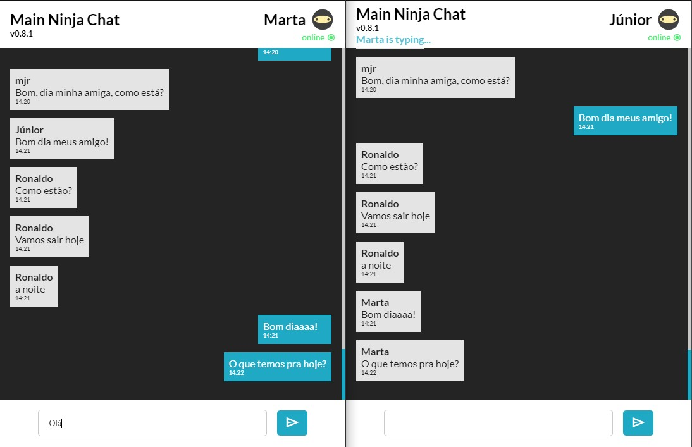

## Ninja Chat

Ninja chat é um projeto de chat em realtime usando Websocket, usa como framework o NestJs, ligado ao banco de dados MySQL, aplicação está conteinerizada em docker.
A aplicação faz uso do Typescript que nos permite implementar metodologias como Clear Code, Princípios do SOLID e Padrões de projetos (Design Patterns).



Tecnologias contidas:

> Backend: \
. NodeJs \
. Typescript \
. NestJs \
. Websocket \
. MySQL \
. Prisma \
. Docker

> Frontend: \
HTML, CSS, Bootstarp & VueJS

## Como rodar

```bash
$ git clone https://github.com/mjrdev/ninjachat.git
$ cd ninja-chat
$ docker composer up --build -d
$ docket -it node bash
$ yarn prisma migrate dev
```

Acesse o endereço http://localhost:3000 (padrão)
